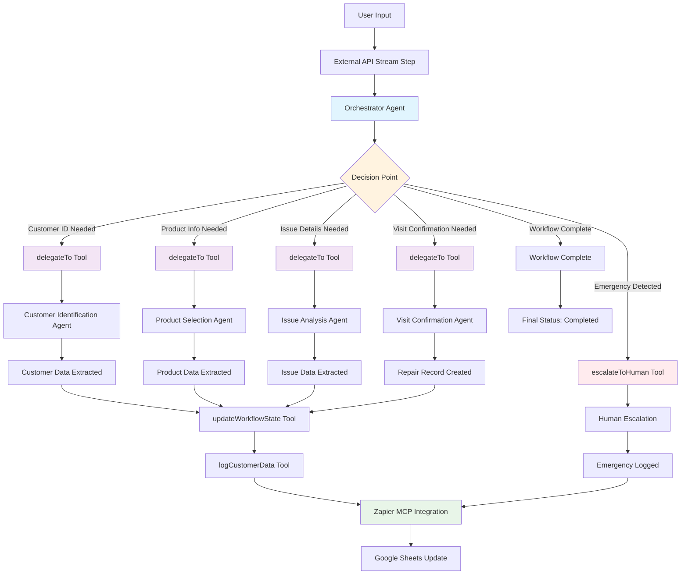

# Sanden Repair System - Accurate Workflow Diagram

## Workflow Details

### 1. User Input
- User provides repair request information
- Session ID generated for tracking

### 2. External API Stream Step
- Connects to: `https://mastra.demo.dev-maestra.vottia.me/api/agents/repair-workflow-orchestrator/stream`
- Emergency keyword detection (火災, 発火, 煙, fire, smoke, burning, etc.)
- Emergency triggers immediate human escalation

### 3. Orchestrator Agent
- **Agent ID**: `repair-workflow-orchestrator`
- **Model**: Claude 3.5 Sonnet (Bedrock)
- **Primary Tool**: `delegateTo` for routing to specialized agents

### 4. Decision Point & Routing
The orchestrator uses the `delegateTo` tool to route to specific agents:

- **Customer ID** → `routing-agent-customer-identification`
- **Product Info** → `repair-agent-product-selection`
- **Issue Details** → `repair-qa-agent-issue-analysis`
- **Visit Confirmation** → `repair-visit-confirmation-agent`

### 5. Specialized Agents
Each agent has specific tools and responsibilities:

#### Customer Identification Agent
- **Tools**: Customer tools, common tools, orchestrator tools
- **Output**: Customer data extraction

#### Product Selection Agent
- **Tools**: Product tools, common tools, orchestrator tools
- **Output**: Product data extraction

#### Issue Analysis Agent
- **Tools**: Repair tools, common tools, orchestrator tools
- **Output**: Issue data extraction

#### Visit Confirmation Agent
- **Tools**: Repair tools, scheduling tools, common tools
- **Output**: Repair record creation

### 6. Tool Calls & Data Flow
- **delegateTo**: Routes to appropriate agent
- **updateWorkflowState**: Updates workflow context
- **logCustomerData**: Logs extracted data
- **escalateToHuman**: Emergency escalation
- **Zapier MCP**: Google Sheets integration for logging

### 7. Data Schema
The workflow uses a unified context schema with Japanese field names:
- **顧客ID**, **会社名**, **メールアドレス**, **電話番号**, **所在地**
- **製品ID**, **製品カテゴリ**, **型式**, **シリアル番号**, **保証状況**
- **問題内容**, **優先度**, **訪問要否**
- **修理ID**, **日時**, **ステータス**, **対応者**

### 8. Emergency Handling
- Automatic keyword detection in user input
- Immediate escalation via `escalateToHuman` tool
- Emergency logs sent to Google Sheets
- Human support notification

### 9. Completion
- All data extracted and logged
- Repair record created
- Workflow status marked as completed
- Session tracking maintained throughout

## Key Differences from Conceptual Diagram

1. **Sequential vs. Branching**: Actual implementation is more sequential with the orchestrator managing flow
2. **Single Orchestrator**: One main agent coordinates all activities rather than separate decision branches
3. **Tool-Based Routing**: Uses `delegateTo` tool for agent routing rather than direct branching
4. **Unified Context**: Single workflow context schema flows through all steps
5. **Emergency Detection**: Built into the external API stream step, not a separate decision branch
