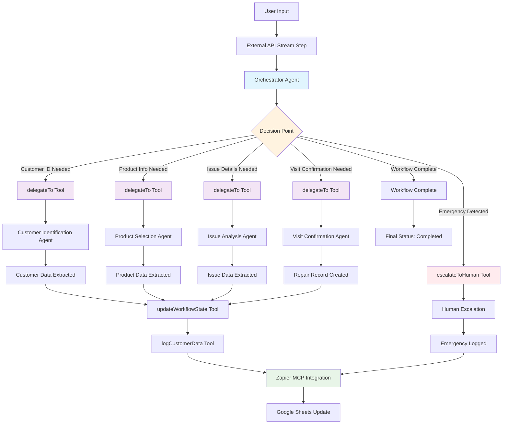

# Sanden Repair System - Current Workflow with Zapier MCP Integration

## Updated Workflow Details with Zapier MCP Integration

### 1. User Input
- User provides repair request information
- Session ID generated for tracking

### 2. External API Stream Step
- Connects to: `https://mastra.demo.dev-maestra.vottia.me/api/agents/repair-workflow-orchestrator/stream`
- Emergency keyword detection (火災, 発火, 煙, fire, smoke, burning, etc.)
- Emergency triggers immediate human escalation

### 3. Orchestrator Agent
- **Agent ID**: `repair-workflow-orchestrator`
- **Model**: Claude 3.5 Sonnet (Bedrock)
- **Primary Tool**: `delegateTo` for routing to specialized agents

### 4. Decision Point & Routing
The orchestrator uses the `delegateTo` tool to route to specific agents:

- **Customer ID** → `routing-agent-customer-identification`
- **Product Info** → `repair-agent-product-selection`
- **Issue Details** → `repair-qa-agent-issue-analysis`
- **Visit Confirmation** → `repair-visit-confirmation-agent`

### 5. Specialized Agents with Zapier MCP Tools
Each agent now has specific Zapier MCP tools:

#### Customer Identification Agent
- **Zapier Tools**: `Google Sheets: Lookup Spreadsheet Rows (Advanced)`
- **Purpose**: Customer lookup by phone, email, company name
- **Worksheet**: "Customers"
- **Output**: Customer data extraction with Japanese column mapping

#### Product Selection Agent
- **Zapier Tools**: `Google Sheets: Lookup Spreadsheet Rows (Advanced)`
- **Purpose**: Product lookup by customer ID
- **Worksheet**: "Products"
- **Output**: Product data extraction

#### Issue Analysis Agent
- **Zapier Tools**: `Google Sheets: Lookup Spreadsheet Rows (Advanced)`
- **Purpose**: Repair history lookup by customer ID
- **Worksheet**: "repairs"
- **Output**: Issue data extraction

#### Visit Confirmation Agent
- **Zapier Tools**: `Google Calendar: Quick Add Event`
- **Purpose**: Schedule repair visit appointments
- **Output**: Calendar event creation

### 6. Zapier MCP Tool Integration Details

#### Available Zapier MCP Tools
1. **Google Sheets: Lookup Spreadsheet Rows (Advanced)**
   - Used for: Customer, Product, and Repair data lookup
   - Worksheets: Customers, Products, repairs, Logs
   - Japanese column headers: 顧客ID, 会社名, メールアドレス, 電話番号, 所在地

2. **Google Sheets: Get Many Spreadsheet Rows (Advanced)**
   - Used for: Bulk data retrieval
   - Fallback when specific lookups fail

3. **Google Sheets: Create Spreadsheet Row**
   - Used for: New customer registration
   - New repair ticket creation
   - Logging activities

4. **Google Sheets: Update Spreadsheet Row**
   - Used for: Updating customer information
   - Updating repair status

5. **Google Calendar: Quick Add Event**
   - Used for: Scheduling repair visits
   - Creating appointment events

6. **AI by Zapier: Extract Content From URL (Beta)**
   - Used for: Content extraction from external sources

#### Tool Usage in Prompts
- **customer-identification-prompt.txt**: Line 35 - `lookupCustomerByDetails(phone, email, companyName)`
- **repair-agent-prompt.txt**: Line 40 - `getCustomerHistory(customerId)`, Line 45 - `getProductsByCustomerId(customerId)`
- **repair-scheduling-prompt.txt**: `scheduleRepairVisit(customerId, productId, issue)`

### 7. Data Schema with Japanese Column Mapping
The workflow uses exact Japanese column headers from Google Sheets:

#### Customers Worksheet
- **顧客ID** (COL$A), **会社名** (COL$B), **メールアドレス** (COL$C), **電話番号** (COL$D), **所在地** (COL$E)

#### Products Worksheet  
- **製品ID** (COL$A), **顧客ID** (COL$B), **製品カテゴリ** (COL$C), **型式** (COL$D), **シリアル番号** (COL$E), **保証状況** (COL$F)

#### Repairs Worksheet
- **Repair ID** (COL$A), **日時** (COL$B), **製品ID** (COL$C), **顧客ID** (COL$D), **問題内容** (COL$E), **ステータス** (COL$F), **訪問要否** (COL$G), **優先度** (COL$H), **対応者** (COL$I)

### 8. Emergency Handling
- Automatic keyword detection in user input
- Immediate escalation via `escalateToHuman` tool
- Emergency logs sent to Google Sheets via Zapier MCP
- Human support notification

### 9. Completion
- All data extracted and logged via Zapier MCP
- Repair record created in Google Sheets
- Calendar appointments scheduled
- Workflow status marked as completed
- Session tracking maintained throughout

## Key Updates from Previous Version

1. **Zapier MCP Integration**: Added specific tool mappings and usage
2. **Japanese Column Headers**: Exact mapping to Google Sheets structure
3. **Tool Functions**: Implemented specific functions for each Zapier tool
4. **Prompt Integration**: Updated tool usage in all prompt files
5. **Data Flow**: Clear path from agents to Zapier MCP to Google Sheets
6. **Calendar Integration**: Added Google Calendar for scheduling
7. **Error Handling**: Fallback strategies for failed lookups

